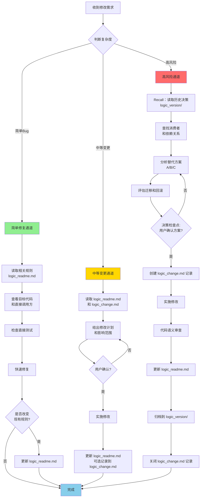
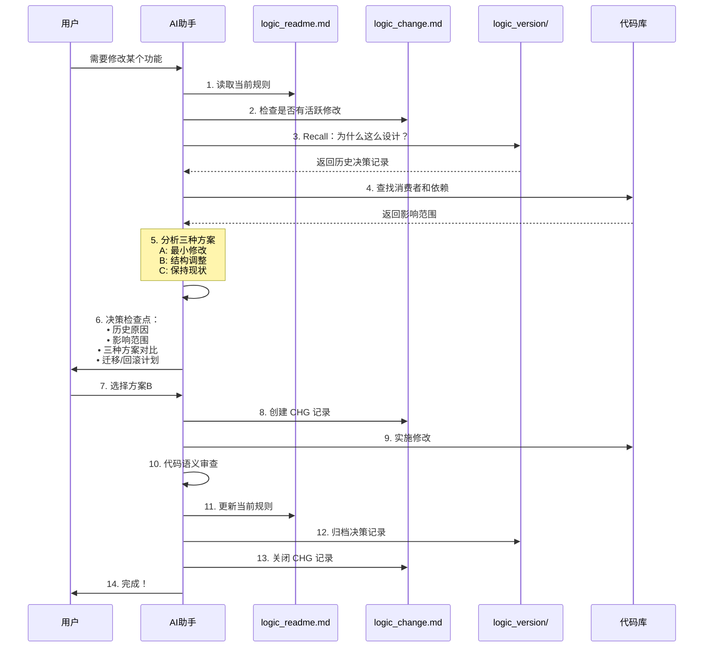
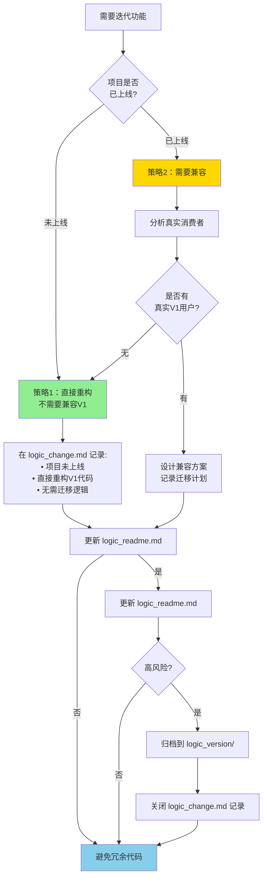
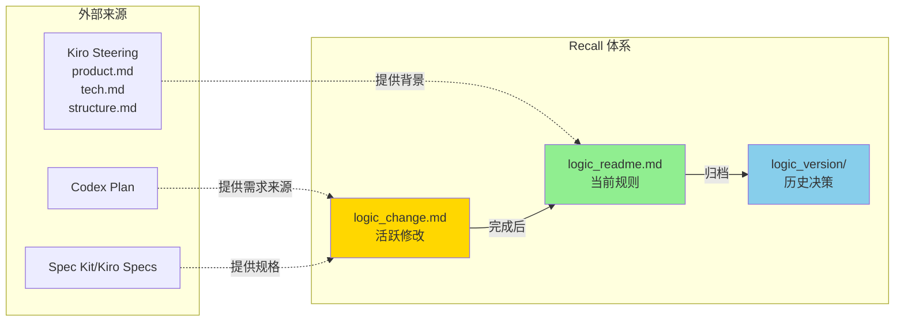
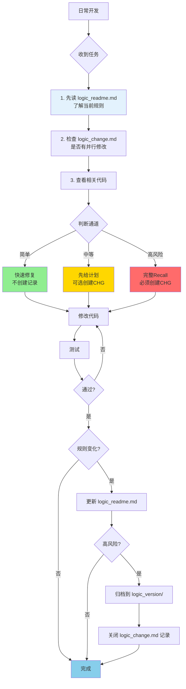
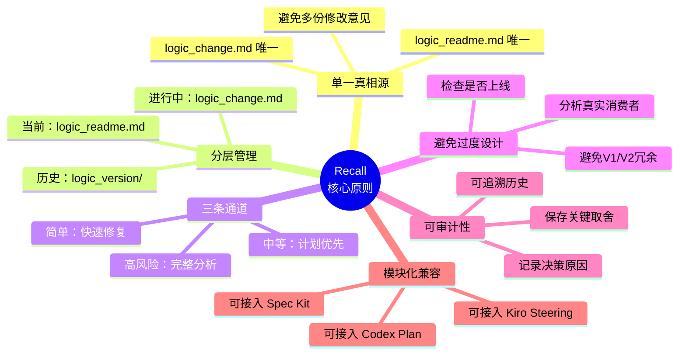

# Recall 可视化流程图

本文档包含 Recall 系统的所有核心流程图，使用 Mermaid 格式便于在 GitHub 和支持 Mermaid 的编辑器中直接渲染。

---

## 1. 文档结构总览

```mermaid
flowchart TB
    subgraph 发布版本（唯一）
        A[logic_readme.md<br/>当前生效规则<br/>最新版本]
        B[logic_change.md<br/>活跃修改记录<br/>未生效]
    end
    
    subgraph 代码库
        E[实际代码]
        F[测试代码]
    end
    
    subgraph 历史归档（多个版本）
        C[logic_version/records/<br/>已完成的决策记录]
        D[logic_version/index.md<br/>历史索引]
    end
    
    A -->|修改完成后更新| A
    B -->|完成后归档| C
    C -->|索引| D
    A -.->|指导| E
    E -.->|验证| F
    
    style A fill:#90EE90
    style B fill:#FFD700
    style C fill:#87CEEB
```

**核心原则**：
- `logic_readme.md` = 当前唯一真相
- `logic_change.md` = 正在进行的修改（临时）
- `logic_version/` = 历史记录（只读，用于回忆）

---

## 2. 三条修改通道



**举例说明**：
- **简单Bug**：UI 显示错误、简单的逻辑修正
- **中等变更**：添加新功能、修改多个文件
- **高风险**：API 修改、数据库迁移、架构重构、V1/V2 兼容问题

---

## 3. 高风险通道 Recall 机制详解



---

## 4. 避免 V1/V2 过度兼容



**关键点**：AI 不会自动知道项目是否上线，需要在 `logic_readme.md` 中明确记录当前状态和真实消费者。

---

## 5. 与其他工具的兼容性



**组合使用示例**：
1. **Kiro Steering** 提供长期背景（product.md / tech.md / structure.md）
2. **Spec Kit** 提供具体规格和需求
3. **Recall** 记录"为什么这么实现"的决策逻辑
4. **Codex Plan** 提供一次性实施计划

---

## 6. 日常工作流程



---

## 7. 核心设计原则



**与访问精神的契合度**：
- ✅ 记录"为什么这么设计"
- ✅ 避免"按下这头翘起那头"
- ✅ 防止 V1/V2 过度兼容
- ✅ 三条通道避免过度流程化
- ✅ 单一真相源（logic_readme.md）
- ✅ 可与其他工具组合使用

---

## 8. 正确方式 vs 错误方式

```mermaid
flowchart LR
    subgraph ❌ 错误方式
        Bad1[收到Bug] --> Bad2[直接让AI修复]
        Bad2 --> Bad3[AI只看当前代码]
        Bad3 --> Bad4[实施修改]
        Bad4 --> Bad5[Bug修复了<br>但破坏了其他功能]
        style Bad5 fill:#FF6B6B
    end
    
    subgraph ✅ 正确方式（Recall）
        Good1[收到Bug] --> Good2[读取 logic_readme.md]
        Good2 --> Good3{高风险?}
        Good3 -->|是| Good4[Recall 历史决策]
        Good4 --> Good5[为什么这么设计?]
        Good5 --> Good6[分析影响范围]
        Good6 --> Good7[提供方案对比]
        Good7 --> Good8[用户决策]
        Good8 --> Good9[实施修改]
        Good9 --> Good10[更新文档]
        Good10 --> Good11[Bug修复<br>且不破坏设计]
        style Good11 fill:#90EE90
    end
```

---

## 如何在项目中使用这些流程图

1. **在 Markdown 文件中引用**：
   ```markdown
   详见流程图：[Recall 流程图](docs/RECALL_FLOW_DIAGRAMS.md#1-文档结构总览)
   ```

2. **在 GitHub 中自动渲染**：
   - GitHub 原生支持 Mermaid 语法
   - 直接查看本文件即可看到渲染效果

3. **在编辑器中预览**：
   - VS Code：安装 "Markdown Preview Mermaid Support" 插件
   - Typora：内置支持
   - Obsidian：内置支持

4. **导出为图片**：
   - 使用 Mermaid Live Editor：https://mermaid.live/
   - 复制代码 → 导出为 PNG/SVG

---

## 许可

本文档遵循项目的 MIT 许可证。
